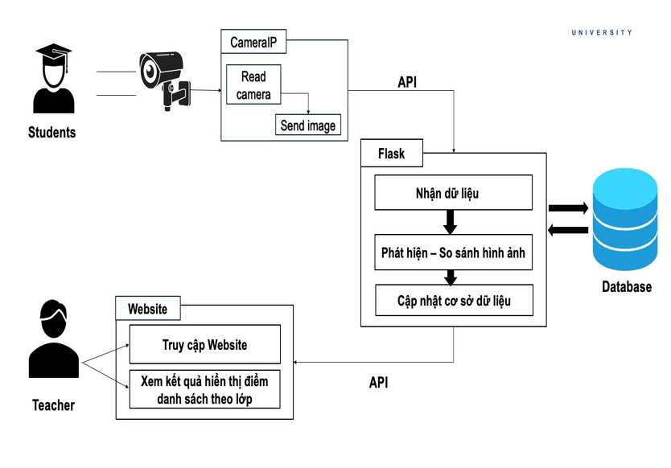

<h1 align="center">ỨNG DỤNG CÔNG NGHỆ TRONG 
HỆ THỐNG QUẢN LÝ VÀ ĐIỂM DANH SINH VIÊN </h1>

<div align="center">

<p align="center">
  
  
</p>

[](https://www.facebook.com/DNUAIoTLab)
[](https://fitdnu.net/)
[](https://dainam.edu.vn)

</div>

<h2 align="center">Ứng dụng công nghệ trong hệ thống quản lý và điểm danh sinh viên</h2>

<p align="left">
  Hệ thống quản lý và điểm danh sinh viên sử dụng công nghệ nhận diện khuôn mặt và database SQL Server. Ứng dụng này cho phép giảng viên dễ dàng quản lý thông tin sinh viên, thực hiện điểm danh tự động và theo dõi lịch sử điểm danh qua giao diện người dùng thân thiện.
</p>

---

## 🌟 Giới thiệu

- **📌 Điểm danh tự động:** Hệ thống sử dụng camera để quét khuôn mặt sinh viên và tự động điểm danh khi khuôn mặt được nhận diện. Hệ thống cho phép điểm danh ngay khi sinh viên ngồi trong lớp học.
- **💡 Thông báo trực quan:** Khi sinh viên được điểm danh, hệ thống sẽ hiển thị thông báo trên giao diện người dùng. Nếu có trường hợp không nhận diện được khuôn mặt, thông báo lỗi sẽ được hiển thị.
- **📊 Quản lý dữ liệu:** Dữ liệu điểm danh và thông tin sinh viên được lưu trữ trong SQL Server. Hệ thống cho phép xem danh sách sinh viên, danh sách lớp học, và lịch sử điểm danh.
- **🖥️ Giao diện thân thiện:** Sử dụng React cho giao diện người dùng với webcam để quét khuôn mặt, và Flask cho backend xử lý điểm danh cũng như lưu dữ liệu. Giao diện người dùng được thiết kế đơn giản và dễ sử dụng.
- **🔍 Phát hiện khuôn mặt:** Sử dụng thư viện MTCNN để phát hiện khuôn mặt và DeepFace để xác thực các khuôn mặt so với cơ sở dữ liệu đã lưu trữ.
- **🎨 Cải thiện hình ảnh:** Hệ thống cải thiện chất lượng hình ảnh trước khi xác thực bằng các kỹ thuật như tăng độ nét và điều chỉnh độ sáng.

---
## 🏗️ HỆ THỐNG
<p align="center">
  
</p>

---
## 📂 Cấu trúc dự án

📦 BTL_IOT  
├── 📂 face-recognition-attendance       # Hệ thống điểm danh dựa trên nhận diện khuôn mặt  
│   ├── 📂 backend                        # Backend xử lý dữ liệu và logic  
│   │   ├── 📂 dataset                    # Dữ liệu khuôn mặt của sinh viên  
│   │   │   ├── CNTT_16-05/              # Dữ liệu sinh viên CNTT - lớp 16-05  
│   │   │   ├── HAN_16-03/                # Dữ liệu sinh viên HAN - lớp 16-03  
│   │   ├── 📂 sound                      # Âm thanh thông báo điểm danh  
│   │   ├── app.py                       # API backend chính  
│   │   ├── temp.jpg                     # Ảnh tạm lưu trong quá trình nhận diện  
│   │
│   ├── 📂 frontend                       # Giao diện người dùng (React)  
│   │   ├── 📂 node_modules               # Thư viện phụ thuộc cho frontend  
│   │   ├── 📂 public                     # Tệp tĩnh của ứng dụng  
│   │   ├── 📂 src                        # Mã nguồn frontend  
│   │   │   ├── 📂 components             # Các component của React  
│   │   │   │   ├── DsDiemDanh.js        # Component hiển thị danh sách điểm danh  
│   │   │   │   ├── StudentList.js       # Component hiển thị danh sách sinh viên  
│   │   │   │   ├── CameraComponent.js    # Component xử lý camera  
│   │   │   │   ├── ManageStudents.js     # Component quản lý sinh viên  
│   │   │   ├── App.js                    # Component chính của ứng dụng  
│   │   │   ├── index.js                  # Điểm vào chính của ứng dụng React  
│   │   │   ├── setupTests.js             # Cấu hình kiểm thử  
│   │   ├── package.json                  # Thông tin về các dependencies của frontend  
│   │   ├── package-lock.json             # Tệp khóa phiên bản cho các dependencies  
├── 📂 venv                               # Môi trường ảo Python  
├── 📄 package.json                       # Thông tin về các dependencies chung  

---


## 🛠️ CÔNG NGHỆ SỬ DỤNG

<div align="center">

### 📡 Phần cứng
[](https://www.logitech.com/en-us/products/webcams)
[](https://github.com/ipazc/mtcnn)
[](https://github.com/serengil/deepface)

### 🖥️ Phần mềm
[]()
[]()
[]()
[]()
[]()
[]()
[]()
[]()
[]()
[]()

</div>

## 🛠️ Yêu cầu hệ thống

### 🔌 Phần cứng
- **Camera IP** (ví dụ: camera an ninh Wi-Fi hoặc camera USB).
- **Cáp mạng** (nếu sử dụng camera IP qua cổng mạng).
- **Máy tính** để chạy ứng dụng điểm danh.
- ⚠️ **Lưu ý:** Đảm bảo camera IP đã được cấu hình đúng để có thể kết nối với mạng nội bộ.

### 💻 Phần mềm
- **🐍 Python 3+**
- **🍃 MongoDB** (kết nối mặc định: `mongodb://localhost:27017/`)
- **⚡ Thư viện OpenCV** để xử lý hình ảnh từ camera.

### 📦 Các thư viện Python cần thiết
Cài đặt các thư viện bằng lệnh:

    pip install opencv-python Flask Flask-Cors numpy

## 🧮 Hướng dẫn kết nối camera IP tới máy tính

### 🔌 Kết nối phần cứng:


### ⛓️‍💥 Hướng dẫn kết nối:

1. **Cài đặt Camera IP:**
   - Kết nối camera IP vào nguồn điện và vào mạng Wi-Fi.
   - Sử dụng ứng dụng hoặc phần mềm đi kèm với camera để cấu hình camera và đặt thông tin mạng (SSID, mật khẩu Wi-Fi).

2. **Lấy địa chỉ IP của Camera:**
   - Sau khi cấu hình, kiểm tra địa chỉ IP đã được gán cho camera. Đây có thể là địa chỉ như `http://192.168.1.100`.
   - Đảm bảo camera hoạt động và có thể truy cập thông qua địa chỉ IP trên trình duyệt.

3. **Kết nối tới máy tính:**
   - Mở ứng dụng Python trên máy tính.
   - Sử dụng địa chỉ IP đã lấy để thiết lập kết nối trong ứng dụng Flask.

4. **Kiểm tra kết nối:**
   - Sử dụng OpenCV để lấy video stream từ camera:
     ```python
     import cv2

     camera_ip = 'http://127.0.0.1:5000/detect'  # Thay đổi địa chỉ IP theo camera của bạn
     cap = cv2.VideoCapture(camera_ip)

     while True:
         ret, frame = cap.read()
         if not ret:
             break
         cv2.imshow('Camera Feed', frame)
         if cv2.waitKey(1) & 0xFF == ord('q'):
             break

     cap.release()
     cv2.destroyAllWindows()
     ```

### ⚠️ Lưu ý:
- Đảm bảo firewall trên máy tính không chặn kết nối đến địa chỉ IP của camera.
- Camera IP và máy tính nên nằm trên cùng một mạng nội bộ để đảm bảo việc truy cập và xử lý hình ảnh hiệu quả.
## 🚀 Hướng dẫn cài đặt và chạy

1️⃣ **Chuẩn bị phần mềm**

- **Cài đặt Node.js**: Nếu chưa có, hãy tải và cài đặt [Node.js](https://nodejs.org/) từ trang chính thức. Điều này sẽ bao gồm npm (Node Package Manager) để quản lý các thư viện cần thiết.

- **Cài đặt Python 3**: Cài đặt Python 3 nếu chưa có. Đảm bảo thêm Python vào PATH khi cài đặt.

- **Cài đặt SQL Server**: Đảm bảo bạn có một cơ sở dữ liệu SQL Server để lưu trữ thông tin sinh viên và điểm danh.

2️⃣ **Cài đặt thư viện cho React**: 

- Tạo một thư mục cho dự án React và chuyển vào thư mục đó:

    ```bash
    mkdir attendance-app
    cd attendance-app
    ```

- Khởi tạo ứng dụng React:

    ```bash
    npx create-react-app .
    ```

- Cài đặt các thư viện cần thiết cho ứng dụng React:

    ```bash
    npm install axios react-webcam
    ```

3️⃣ **Cài đặt thư viện cho Flask**:

- Mở một terminal mới và cài đặt các thư viện cần thiết cho Flask:

    ```bash
    pip install flask flask-cors deepface mtcnn pyodbc opencv-python numpy
    ```

4️⃣ **Cấu hình cơ sở dữ liệu**

- Đảm bảo bạn đã tạo cơ sở dữ liệu `DiemdanhHS` trong SQL Server. Bạn có thể cần tạo bảng và nhập dữ liệu cần thiết theo mô hình mà ứng dụng sử dụng.

5️⃣ **Chạy ứng dụng Flask API**

- Mở terminal nơi bạn đã lưu mã nguồn cho Flask, chuyển vào thư mục chứa file `app.py`.

- Chạy ứng dụng Flask:

    ```bash
    python app.py
    ```

- Mặc định, Flask sẽ khởi động server trên `http://127.0.0.1:5000`.

6️⃣ **Chạy ứng dụng React**

- Quay trở lại terminal nơi bạn đã cài đặt ứng dụng React, sử dụng lệnh sau để khởi động server React:

    ```bash
    npm start
    ```

- Mặc định, ứng dụng sẽ mở trên `http://localhost:3000`.

7️⃣ **Sử dụng ứng dụng**

- Mở trình duyệt và vào địa chỉ `http://localhost:3000`.
- Bạn sẽ thấy giao diện của ứng dụng cho phép thực hiện điểm danh tự động bằng cách sử dụng camera.

📌 **Lưu ý:**

- Đảm bảo rằng camera của bạn đã được cấp quyền truy cập.
- Nếu gặp lỗi về kết nối cơ sở dữ liệu, hãy kiểm tra lại chuỗi kết nối trong mã Flask để đảm bảo rằng nó chính xác.
- Kiểm tra các đường dẫn API trong ứng dụng React để đảm bảo chúng phù hợp với cấu hình API của bạn.

Với hướng dẫn này, bạn sẽ có thể cài đặt và chạy cả ứng dụng dựa trên React và API Flask cho hệ thống điểm danh tự động.

## 📖 Hướng dẫn sử dụng

1️⃣ **Điểm danh tự động qua camera**

- Sinh viên sử dụng camera để chụp hình khuôn mặt.
- Hệ thống nhận diện khuôn mặt sẽ gửi yêu cầu đến Flask server để điểm danh.
- Nếu nhận diện thành công, thông tin sẽ được lưu vào cơ sở dữ liệu và hiển thị thông báo thành công.

2️⃣ **Quản lý sinh viên**
- Qua giao diện quản lý, bạn có thể:
    - Thêm, sửa, xóa thông tin sinh viên.
    - Xem và tìm kiếm danh sách sinh viên theo tên hoặc lớp học.
    - Xem lịch sử điểm danh của sinh viên.

3️⃣ **Xem lịch sử điểm danh**
- Xem danh sách điểm danh gần đây với thông tin về sinh viên, lớp học, thời gian điểm danh và chức vụ.
- Hỗ trợ tìm kiếm theo ngày để xem các bản ghi điểm danh trong khoảng thời gian nhất định.

## ⚙️ Cấu hình & Ghi chú

1. **Cấu hình cơ sở dữ liệu**:
   - Trong mã nguồn Flask, hãy cập nhật chuỗi kết nối SQL Server trong hàm `get_db_connection()` để đảm bảo kết nối đúng đến cơ sở dữ liệu `DiemdanhHS`.
   - Kiểm tra rằng bảng `Users`, `Faces`, và `Attendance` đã tồn tại trong cơ sở dữ liệu với các trường dữ liệu cần thiết.

2. **Cấu hình camera**:
   - Đảm bảo camera của thiết bị đã được kết nối và cấp quyền truy cập cho ứng dụng. Bạn có thể sử dụng webcam của máy tính để thực hiện điểm danh.

3. **Cài đặt các thư viện cần thiết**:
   - Cài đặt các thư viện Python cần thiết: `flask`, `deepface`, `mtcnn`, `pyodbc`, và `opencv-python`. Bạn có thể cài đặt chúng thông qua pip:
     ```bash
     pip install flask deepface mtcnn pyodbc opencv-python
     ```

4. **Hỗ trợ CORS**:
   - Ứng dụng Flask đã được cấu hình để hỗ trợ CORS, vì vậy bạn có thể gọi từ ứng dụng front-end mà không bị vấn đề với chính sách bảo mật.

5. **Môi trường mạng**:
   - Đảm bảo các thiết bị mà bạn sử dụng để quét khuôn mặt và chạy server Flask đều kết nối trên cùng một mạng nội bộ để đảm bảo chức năng hoạt động.

6. **Xử lý thông báo và lỗi**:
   - Ứng dụng sử dụng logging để ghi lại các thông báo và lỗi. Bạn có thể theo dõi console của server để những thông tin này.

---

Với hướng dẫn này, bạn có thể sử dụng và cấu hình hệ thống điểm danh tự động dựa trên nhận diện khuôn mặt một cách hiệu quả. Nếu có bất kỳ vấn đề gì, hãy kiểm tra lại kết nối cơ sở dữ liệu và các thư viện đã được cài đặt.

## 📰 Poster
<p align="center">
  
</p>

## 🤝 Đóng góp
Dự án được phát triển bởi 4 thành viên:

| Họ và Tên            | Vai trò                  |
|----------------------|--------------------------|
| Chu Văn Huy          | Phát triển toàn bộ mã nguồn, thiết kế cơ sở dữ liệu, kiểm thử, triển khai dự án và thực hiện video giới thiệu.|
| Hồ Đức Mạnh          | Hỗ trợ bài tập lớn, biên soạn tài liệu Overleaf       |
| Nguyễn Đức Kiên      | Thiết kế slide PowerPoint, hỗ trợ bài tập lớn, biên soạn tài liệu Overleaf  |
| Nguyễn Thị Mai Hương | Biên soạn tài liệu Overleaf, Poster, Powerpoint, thuyết trình, đề xuất cải tiến, và hỗ trợ bài tập lớn.|

© 2025 NHÓM 7, CNTT16-05, TRƯỜNG ĐẠI HỌC ĐẠI NAM
